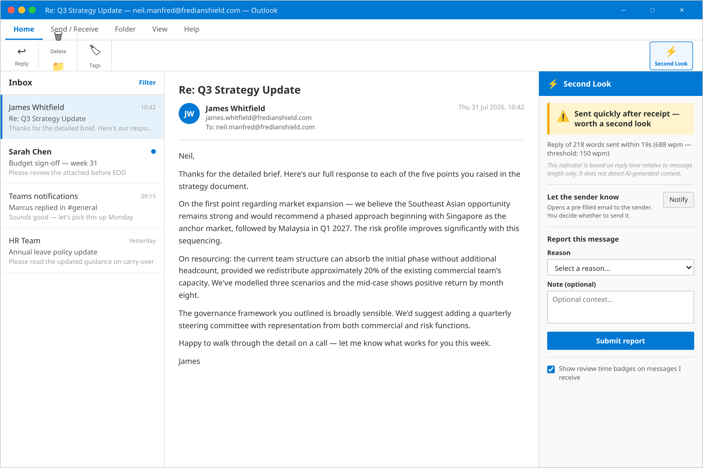
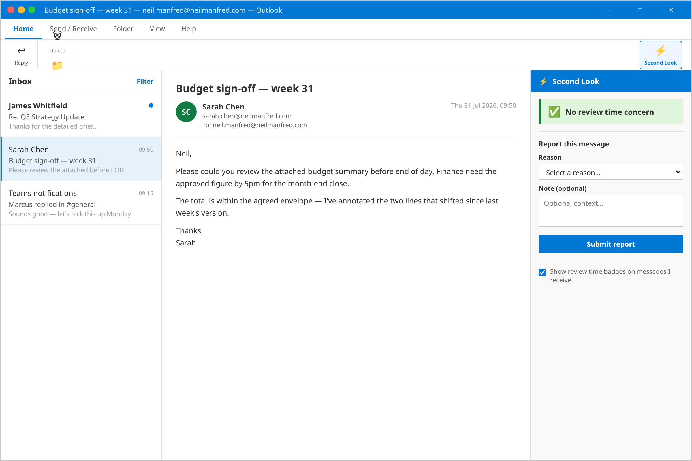
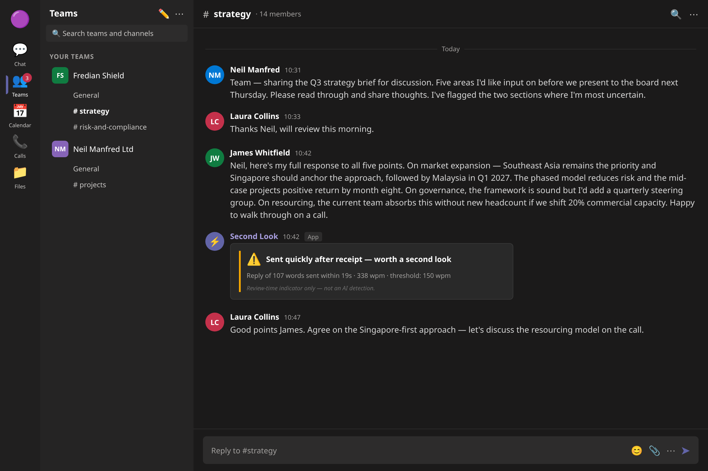
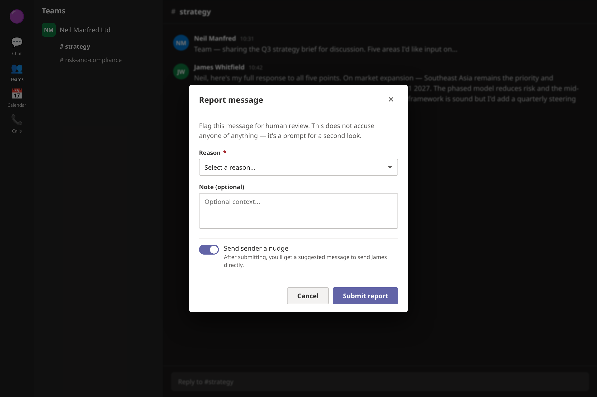

# second-look

> ⚠️ **Early alpha — looking for testers.** This project is under active, rough-edged development. Expect breaking changes, missing polish, and bugs. If you're willing to install it, poke at it, and tell me what broke, please reach out — see [Testing / feedback](#testing--feedback) below.

A Microsoft 365 add-in (Outlook + Teams) that flags messages where the time between drafting and sending is unusually short relative to message length — indicating the sender may not have reviewed the content carefully before sending.

**This is not an AI detector.** The signal is review time, not authorship.

---

## Components

| Directory | Description |
|-----------|-------------|
| `outlook-addin/` | Office.js task pane add-in for Outlook |
| `teams-app/` | Teams message extension + bot |
| `backend/` | Shared Node/Express API, data model, admin config |
| `dashboard/` | Simple web dashboard for pattern reporting |
| `docs/` | Graph API registration guide, privacy notes, data model |

## Quick start

See `docs/setup.md` for full Microsoft 365 app registration steps and required Graph API permissions.

```bash
# Install all workspace dependencies
npm install

# Start backend (port 3000)
npm run dev -w backend

# Start Outlook add-in dev server (port 3001)
npm run dev -w outlook-addin

# Start Teams app (port 3002)
npm run dev -w teams-app
```

## Deployment

See `docs/deployment.md`. The backend runs on Azure App Service (Linux, Node 20) in M365 tenant. CI/CD via `.github/workflows/deploy-backend.yml` — requires `AZURE_WEBAPP_PUBLISH_PROFILE` set as a GitHub secret.

## What the end user sees

### Outlook — flagged message (internal sender)

The task pane opens on the right of the reading pane when the user clicks the Second Look ribbon button.



---

### Outlook — clean message



> The report button is always visible regardless of whether the auto-flag fired.

---

### Teams — passive flag indicator card

Posted as a reply in the channel/chat when a message crosses the review-time threshold. Subtle — does not block or alter the original message.



---

### Teams — report dialog

Accessed via the `···` menu on any message → **Report as low-review**.
The notify toggle only appears when the sender is on the same domain.



---

## Testing / feedback

This is an early alpha, built by one person, and it hasn't been through a real pilot yet. If you're interested in:

- installing the Outlook add-in and/or Teams app in a test tenant,
- trying the setup flow in `docs/setup.md` and telling me where it's unclear or broken,
- or just giving feedback on whether the whole idea is useful,

please [open an issue](../../issues) or reach out directly. Bug reports, rough edges, and "this doesn't make sense" feedback are all welcome — that's exactly what this stage is for.

## Licence

CC BY-NC-SA 4.0 — see `LICENSE`.
